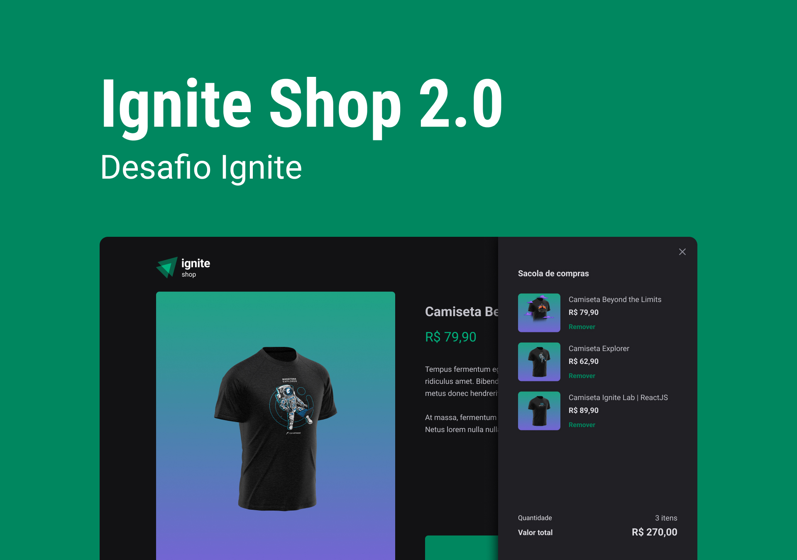

# React JS - Ignite - Desafio 04




Aplicação que simula um e-commerce de camisetas utilizando integração com o Stripe. Essa aplicação é uma versão melhorada do Ignite Shop 1.0.

#

## Funcionalidades

- Listar produtos com preços e descrição;
- Mostrar um produto em detalhe;
- Finalizar compra de um produto;
- Adcionar/remover itens no carrinho de compras;
- Geração de página estática;
- Utilização de "rotas back-end (NextJS)" para checkout.


## Stack utilizada

**Front-end:**
- ReactJS
- TypeScript

**Back-end:**
- NextJS

**Integrações:**
- Stripe


## Rodando localmente

Clone o projeto

```bash
  git clone https://github.com/fellipebastos/ignite-shop-2.0.git
```

Entre no diretório do projeto

```bash
  cd ignite-shop
```

Instale as dependências

```bash
  npm install
```

Inicie o servidor

```bash
  npm run dev
```


## Autores

- [@fellipebastos](https://www.github.com/fellipebastos)

